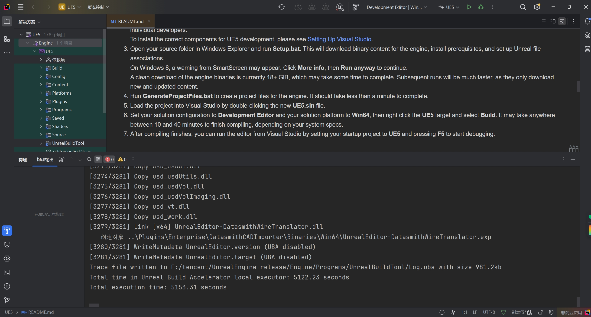
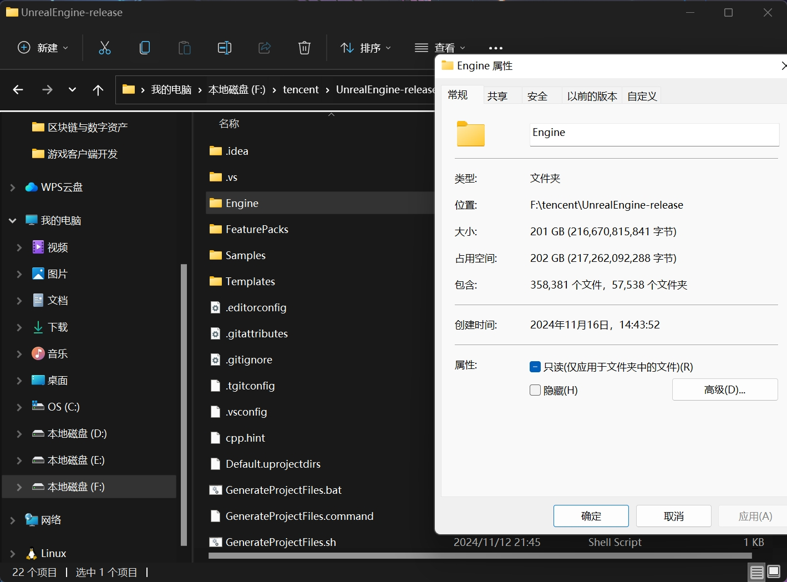
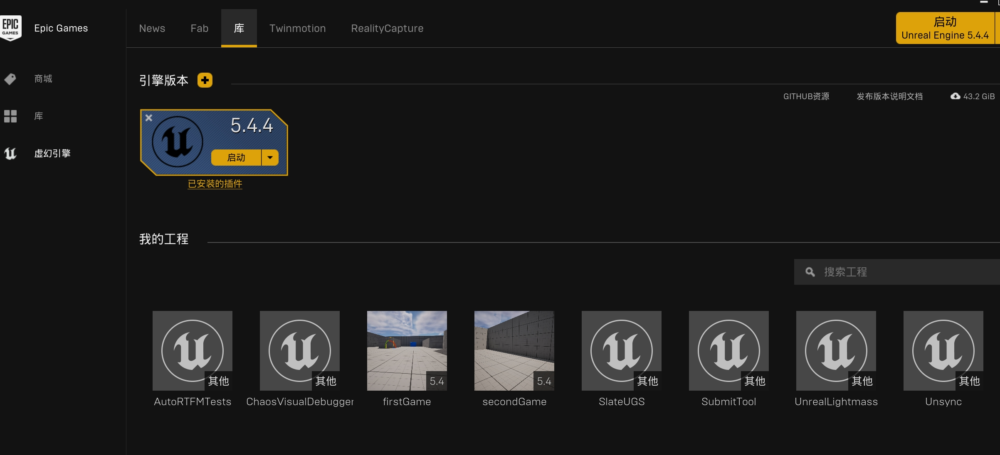
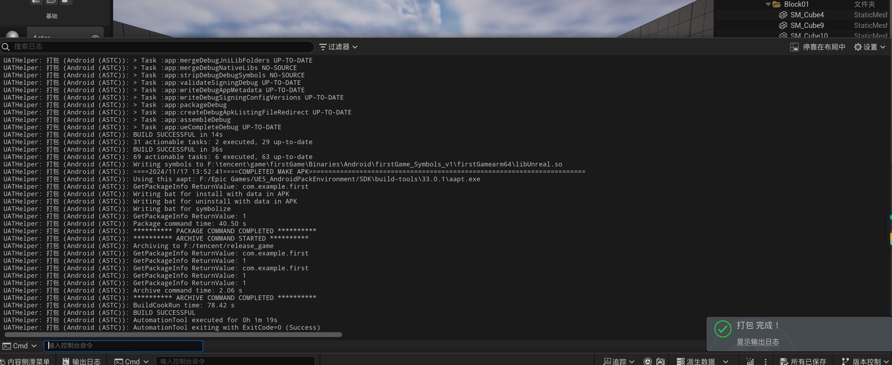
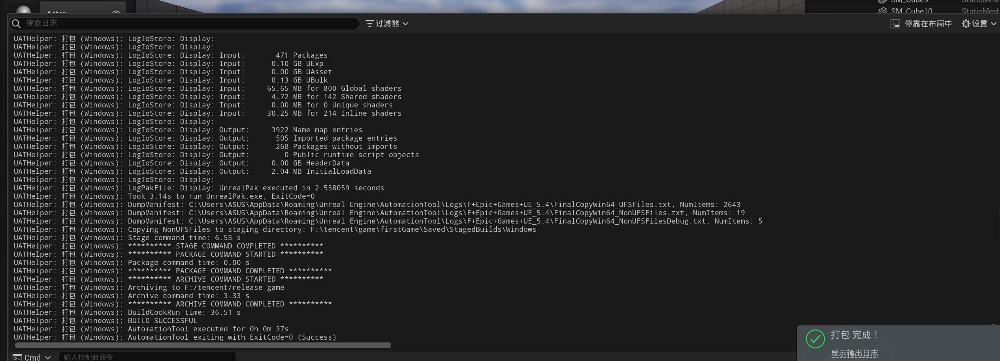

# 第一周作业

## 构建源码
这里使用源码的版本是5.5.0

### 源码编译
因为编译中断了几次，所以编译项只有3000多项，但是前前后后一共编译了6000多项

### 源码体积
编译完成后engine文件夹一共202GB

### 启动
启动编译好的ue

### 发行版下载
发行版下载的版本是5.4.4

## 打包项目
在不同的平台上打包项目

### Android打包

### Windows打包
